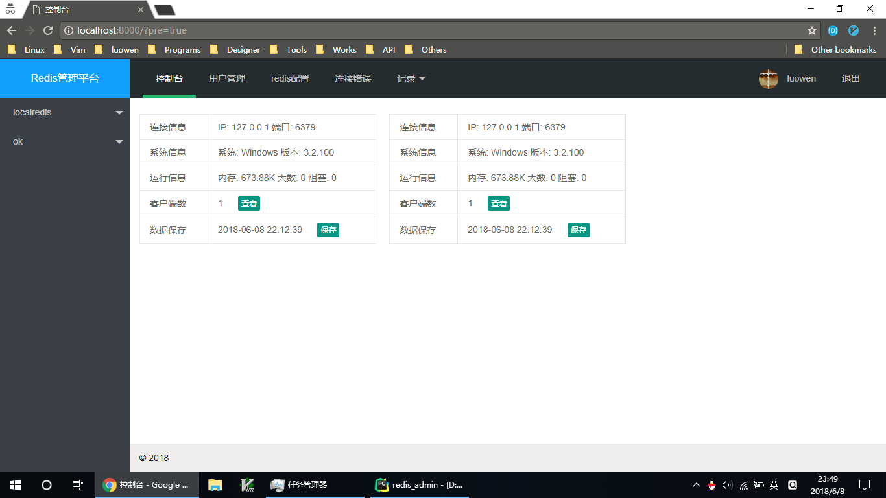
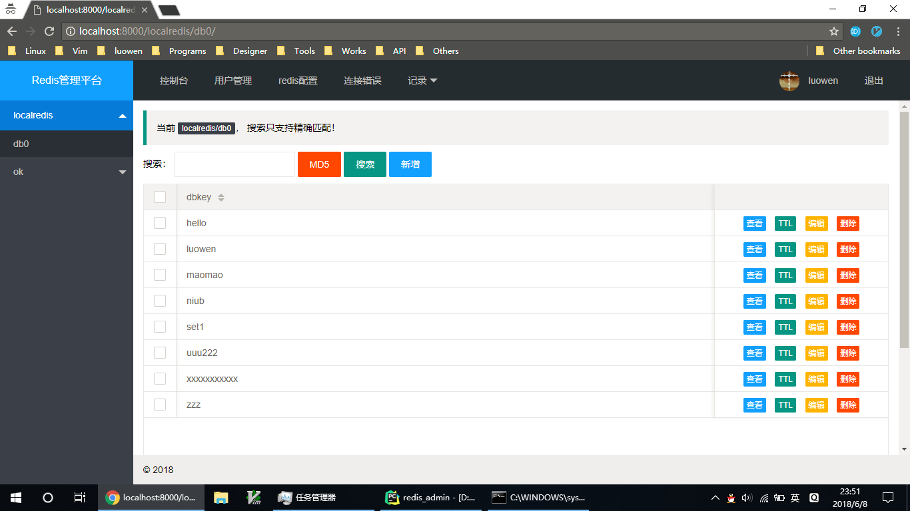

## redis admin

1. 环境 python 2.7 (python3.x赞不支持, 别瞎折腾)
2. 项目来源于 [码云, careyjike](https://gitee.com/careyjike_173/redis_web_client)
3. 对部分功能做了修改

### 安装

```
$ mkdir -p /data/wwwroot/ && cd /data/wwwroot
$ git clone https://github.com/loovien/redis_admin.git
cd redis_admin && pip install -r requirements.txt
```

### 配置

```
$ vim conf/conf.py
DEBUG = True  # debug模式
LOG_LEVEL = 'INFO'  # 日志级别
# 邮件信息
mail_host = 'smtp.exmail.qq.com'
mail_user = 'test@test.com'
mail_pass = 'xxx'
mail_receivers = ["test@test.com", "test2@test.com"]

# 数据库信息
database = {
    "name": "redis_admin",
    "host": "127.0.0.1",
    "username": "root",
    "password": "root",
    "port": "3306",
}
```

### 生成数据库表文件

```
python manage.py migrate
```

  
### 安装 nginx

```
$ yum install nginx -y
```
配置nginx

```
  server {
  listen 80;
  server_name custom.domain.com;
  access_log /data/logs/access_redis_admmin.log combined;
  index index.html index.htm index.php;

  location / {
        proxy_pass http://127.0.0.1:8000;
        proxy_add_header Host $host;
  }

  location /static {
        expires 7d;
        autoindex on;
        add_header Cache-Control provate;
        alias /data/wwwroot/redis_admin/static;
  }
```

### 启动 `redis_admin`

```
chmod +x start.sh
./start.sh start
```

启动`nginx`

```
service nginx start
```

### 创建超级用户

```bash
$ python manager.py createsuperuser
```

更具提示创建好root用户


### 访问

http://custom.domain.com


### 预览



